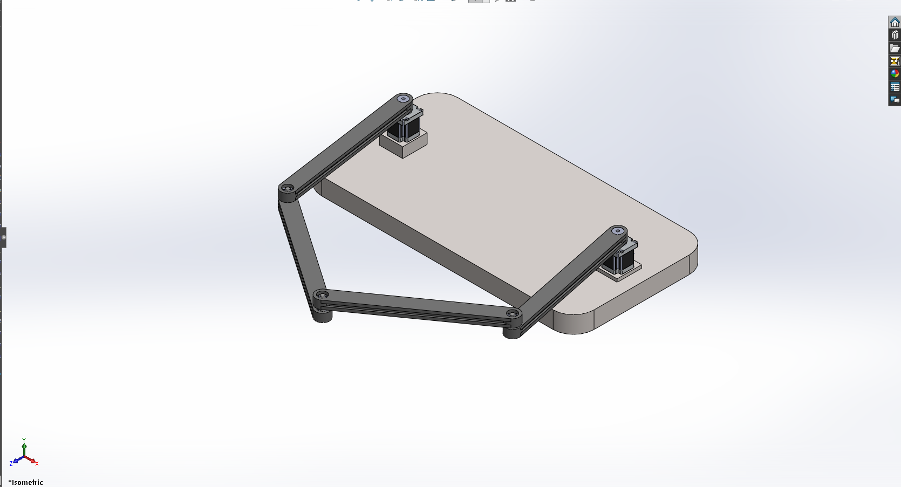
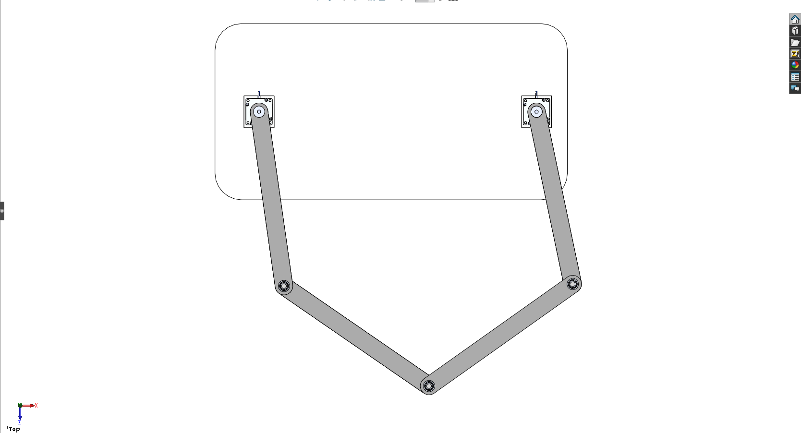
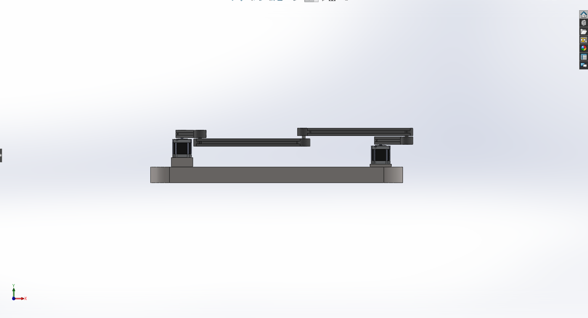
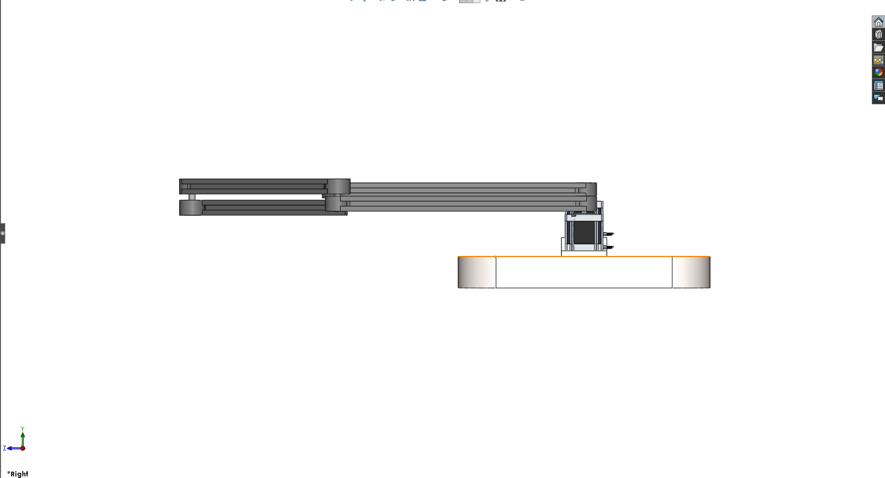
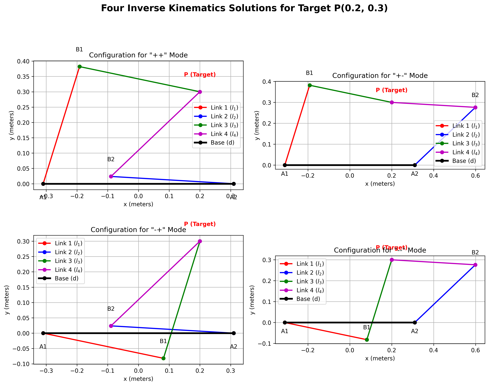
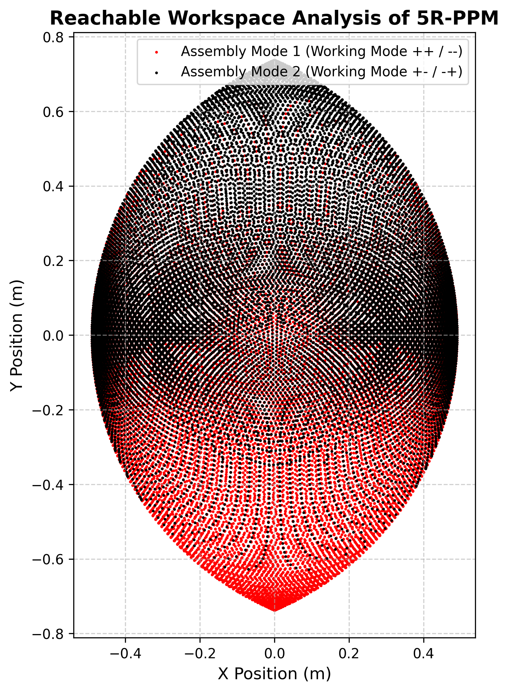
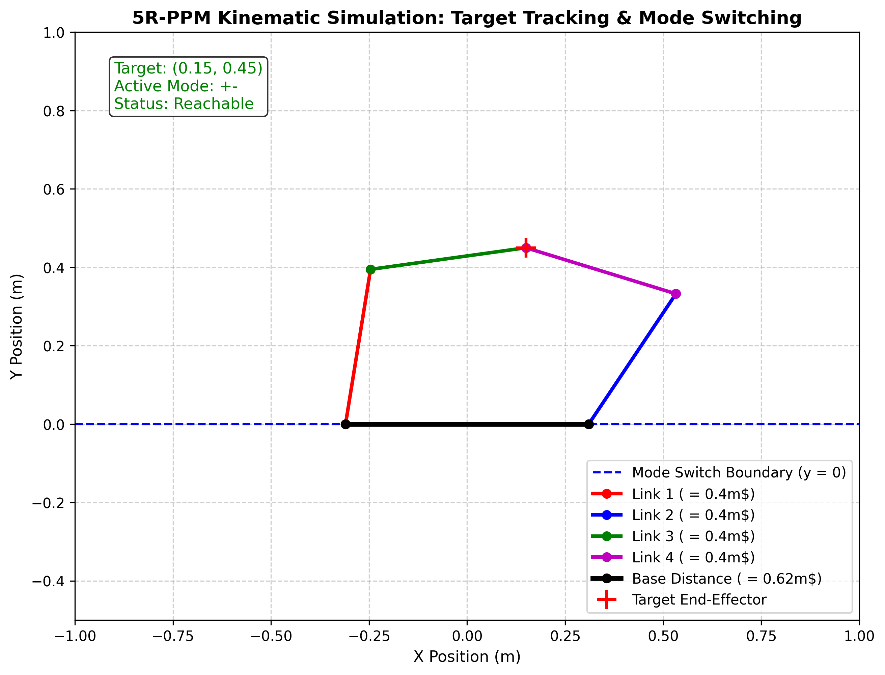

# 5R Planar Parallel Mechanism (5R-PPM) Robot

[](https://www.python.org/)
[](https://numpy.org/)
[](https://matplotlib.org/)
[](https://www.solidworks.com/)
[](https://www.ros.org/)
[](LICENSE)

A complete hardware and software framework for a 2-DOF 5R Planar Parallel Manipulator (5R-PPM). This project includes analytical kinematic modeling, reachable workspace discretization, real-time interactive mouse-tracking simulation with dynamic mode switching, complete 3D mechanical CAD models, and ROS URDF description packages.

---

## Visual Overview

<p align="center">
  
  <br>
  <em>Figure 1: Full 3D SolidWorks assembly of the 5R Planar Parallel Mechanism featuring dual Nema24 actuators, tiered link elevations, and deep-groove ball bearings.</em>
</p>

---

## Key Features

* **Analytical Kinematic Solver**: Closed-form inverse kinematics (IK) and forward kinematics (FK) solutions without iterative approximation.
* **Four Assembly Configurations**: Full resolution of all four distinct working modes (`++`, `+-`, `-+`, `--`).
* **Real-Time Interactive Tracking**: Live end-effector cursor following with dynamic boundary mode switching to maintain link continuity.
* **Reachable Workspace Mapping**: High-resolution discretization of joint space identifying boundary envelopes for both assembly modes.
* **Collision-Free Mechanical Design**: Dual-plane tiered link clearance architecture preventing mechanical interference throughout the active workspace.
* **Industrial CAD and ROS Integration**: Production-ready SolidWorks assemblies, STEP/STL export files, and a complete ROS URDF package for RViz and Gazebo simulation.

---

## Mechanical Architecture and CAD Models

The 5R planar parallel mechanism consists of five revolute joints arranged in a closed kinematic chain. Two proximal links are driven by stationary base actuators, while two distal links intersect at the passive end-effector joint.

### Multi-View Engineering Renders

| View | Screenshot | Description |
| :--- | :---: | :--- |
| **Top (Plan) View** |  | Symmetric layout showing baseline distance $d = 0.62\text{ m}$ between actuator pivots $A_1$ and $A_2$. |
| **Front Elevation View** |  | Multi-tiered vertical offsets ensuring collision-free motion across overlapping link trajectories. |
| **Right Side View** |  | Bearing housings, motor shaft couplers, and vertical link stack clearances. |

### Mechanism Parameters

| Parameter | Symbol | Dimension | Notes |
| :--- | :---: | :---: | :--- |
| Baseline Actuator Distance | $d$ | $0.62\text{ m}$ | Distance between fixed pivot points $A_1$ and $A_2$ |
| Proximal Link 1 Length | $l_1$ | $0.40\text{ m}$ | Left active link mounted to Motor 1 |
| Proximal Link 2 Length | $l_2$ | $0.40\text{ m}$ | Right active link mounted to Motor 2 |
| Distal Link 3 Length | $l_3$ | $0.40\text{ m}$ | Left passive link connecting joint $B_1$ to End-Effector $P$ |
| Distal Link 4 Length | $l_4$ | $0.40\text{ m}$ | Right passive link connecting joint $B_2$ to End-Effector $P$ |
| Actuator Model | - | Nema 24 | High torque closed-loop stepper (24CS22C-400) |
| Bearing Type | - | 6000 Deep Groove | Low friction precision miniature ball bearings |

---

## Kinematics Formulation

### 1. Mobility Analysis

The degree of freedom (DOF) is calculated using the planar Grübler-Kutzbach criterion:

$$F = 3(N - 1) - 2J_1 - J_2$$

Where:
* $N = 5$ (Number of links including the stationary base plate)
* $J_1 = 5$ (Number of 1-DOF revolute joints: $A_1, A_2, B_1, B_2, P$)
* $J_2 = 0$ (Higher-pair joints)

$$F = 3(5 - 1) - 2(5) = 12 - 10 = 2\text{ DOF}$$

The planar manipulator is fully actuated using two independent rotational actuators.

### 2. Inverse Kinematics (IK)

Given a target end-effector coordinate $P(x, y)$, calculate actuator angles $\theta_1$ and $\theta_2$.

Actuator coordinates:
* $A_1 = \left(-\frac{d}{2}, 0\right)$
* $A_2 = \left(\frac{d}{2}, 0\right)$

Distances from base actuators to end-effector:

$$a_1 = \|P - A_1\| = \sqrt{\left(x + \frac{d}{2}\right)^2 + y^2}$$

$$a_2 = \|P - A_2\| = \sqrt{\left(x - \frac{d}{2}\right)^2 + y^2}$$

Base angle vectors:

$$\alpha_1 = \text{atan2}\left(y, x + \frac{d}{2}\right)$$

$$\alpha_2 = \text{atan2}\left(y, x - \frac{d}{2}\right)$$

Applying the Law of Cosines to triangles $\triangle A_1 B_1 P$ and $\triangle A_2 B_2 P$:

$$\cos(\beta_1) = \frac{l_1^2 + a_1^2 - l_3^2}{2 l_1 a_1}$$

$$\cos(\beta_2) = \frac{l_2^2 + a_2^2 - l_4^2}{2 l_2 a_2}$$

Reachability is validated if $|\cos(\beta_1)| \le 1$ and $|\cos(\beta_2)| \le 1$. The four valid working modes are:

$$\theta_1 = \alpha_1 \pm \beta_1, \quad \theta_2 = \alpha_2 \pm \beta_2$$

<p align="center">
  
  <br>
  <em>Figure 2: Four distinct inverse kinematic assembly configurations for target position P(0.2, 0.3).</em>
</p>

### 3. Forward Kinematics (FK)

Given joint angles $(\theta_1, \theta_2)$, determine end-effector location $P(x, y)$:

1. Compute intermediate joint positions:
   $$B_1 = A_1 + [l_1 \cos\theta_1, l_1 \sin\theta_1]^T$$
   $$B_2 = A_2 + [l_2 \cos\theta_2, l_2 \sin\theta_2]^T$$
2. End-effector $P$ is determined via circle intersection between circles centered at $B_1$ (radius $l_3$) and $B_2$ (radius $l_4$).

---

## Reachable Workspace Analysis

The workspace is computed by sweeping both actuator inputs $\theta_1, \theta_2 \in [0, 2\pi]$ across a high-resolution grid and computing feasible circle intersections.

<p align="center">
  
  <br>
  <em>Figure 3: Reachable workspace mapping for Assembly Mode 1 (red) and Assembly Mode 2 (black).</em>
</p>

---

## Interactive Simulation and Tracking

The project includes an interactive simulation (`Mosue_tracking.py`) built on Matplotlib. Moving the mouse updates the target coordinates $P(x, y)$ in real time.

<p align="center">
  
  <br>
  <em>Figure 4: Real-time simulation interface demonstrating dynamic mode switching across the boundary y = 0.</em>
</p>

### Dynamic Mode Switching Logic

To prevent mechanism singularity and link crossing during continuous trajectory tracking:
* When $y \ge 0$: Robot operates in `+-` mode.
* When $y < 0$: Robot switches smoothly to `-+` mode.
* When entering an unreachable coordinate: The robot locks at its last valid kinematic pose until the target re-enters the valid workspace.

---

## Project Structure

```text
5r/
├── assets/                          # Documentation screenshots and CAD renders
│   ├── cad_isometric_view.png       # Isometric SolidWorks assembly render
│   ├── cad_front_view.png           # Front elevation clearance view
│   ├── cad_top_view.png             # Top-down planar layout
│   ├── cad_side_view.png            # Side elevation view
│   ├── ik_solutions.png             # Four IK assembly modes
│   ├── tracking_simulation.png      # Interactive tracking visualization
│   └── workspace_analysis.png       # Feasible workspace boundary map
├── SS/                              # Original full-resolution CAD renders
├── 5r_cad_model/                    # CAD assemblies, part files, and ROS packages
│   ├── Main.SLDASM                  # Master SolidWorks assembly
│   ├── main_5r_step.STEP            # Complete STEP export model
│   ├── *.STL                        # Individual 3D printable link and bracket meshes
│   ├── Nema24 24CS22C-400.STEP      # Actuator CAD models
│   └── urdf_5r/                     # ROS package (CMakeLists, package.xml, URDF, meshes)
├── Parallel_5r_arm.py               # Core kinematics engine and workspace visualizer
├── r5ppm_simulator.py               # Kinematic simulation class with mode selector
├── Mosue_tracking.py                # Real-time interactive mouse tracking animation
├── fessibility_pts.py               # Workspace feasibility computation script
├── requirements.txt                 # Python dependencies
├── .gitignore                       # Standard version control filter
└── README.md                        # Project documentation
```

---

## Getting Started

### 1. Prerequisites

* Python 3.8 or higher
* Git

### 2. Installation

Clone this repository and install dependencies:

```bash
git clone git@github.com:<your-username>/<your-repo-name>.git
cd <your-repo-name>
pip install -r requirements.txt
```

### 3. Running the Simulations

* **Interactive Mouse Tracker**:
  ```bash
  python Mosue_tracking.py
  ```
  Move the mouse inside the window to control the robot in real time.

* **Inverse Kinematics Demonstration**:
  ```bash
  python Parallel_5r_arm.py
  ```
  Calculates and displays all 4 kinematic solutions for a designated target.

* **Reachable Workspace Analysis**:
  ```bash
  python fessibility_pts.py
  ```
  Computes and visualizes the complete reachable workspace point cloud.

---

## References

1. Ratolikar, M. D., & Kumar, P. R. "Optimized design of 5R planar parallel mechanism aimed at gait-cycle of quadruped robots."
2. Merlet, J.-P. *Parallel Robots*. Springer Science & Business Media.
3. Tsai, L.-W. *Robot Analysis: The Mechanics of Serial and Parallel Manipulators*. John Wiley & Sons.

---

## License

This project is licensed under the MIT License.
